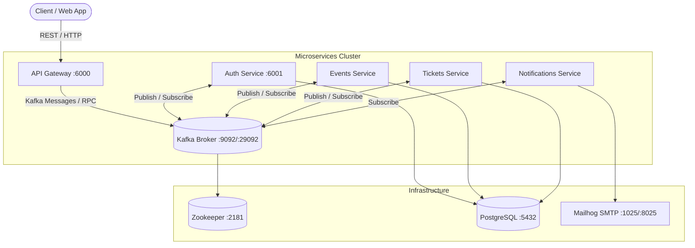

Ran command: `yarn run dev`
Ran command: `clear`
Listed directory eventflow-manage
Viewed package.json:1-81
Listed directory apps
Listed directory libs
Viewed nest-cli.json:1-50
Viewed docker-compose.yml:1-215
Viewed README.md:1-99
Viewed istall.md:1-61
Listed directory src
Listed directory src
Listed directory src
Listed directory src
Viewed main.ts:1-12
Viewed main.ts:1-11
Listed directory constants
Listed directory dto
Listed directory interface
Listed directory constant
Viewed kafka.module.ts:1-33
Viewed services.constant.ts:1-19
Viewed kafka.constants.ts:1-33
Viewed app.module.ts:1-11
Viewed auth-service.controller.ts:1-13
Viewed app.controller.ts:1-13
Viewed app.service.ts:1-10
Viewed auth-service.module.ts:1-11
Viewed user.interface.ts:1-12

Here is an analysis of your **EventFlow Manage** codebase, detailing its architecture, current state, and operational workflows.

---

## 🏛️ Codebase Overview & Architecture

Your codebase is structured as a **NestJS Monorepo** ([nest-cli.json](file:///Users/ssjoy/micro-service/eventflow-manage/nest-cli.json)) designed around an **Event-Driven Microservices Architecture** powered by **Apache Kafka** and **PostgreSQL**.

### 1. Monorepo Structure
The project separates applications (`apps/`) from shared libraries (`libs/`):

* **Applications (`apps/`)**:
  * **[api-gateway](file:///Users/ssjoy/micro-service/eventflow-manage/apps/api-gateway)**: Serves as the primary public entry point for client HTTP requests. Currently runs on port `6000` (`SERVICE_PORTS.API_GATEWAY` configured in [services.constant.ts](file:///Users/ssjoy/micro-service/eventflow-manage/libs/common/src/constants/services.constant.ts#L12)).
  * **[auth-service](file:///Users/ssjoy/micro-service/eventflow-manage/apps/auth-service)**: Handles user authentication and user-related workflows (`SERVICE_PORTS.AUTH_SERVICE` configured on port `6001`).

* **Shared Libraries (`libs/`)**:
  * **[common (`@app/common`)](file:///Users/ssjoy/micro-service/eventflow-manage/libs/common)**: Houses cross-cutting concerns shared across all microservices:
    * **Constants**: Service names (`SERVICES`) and assigned ports (`SERVICE_PORTS`) in [services.constant.ts](file:///Users/ssjoy/micro-service/eventflow-manage/libs/common/src/constants/services.constant.ts).
    * **Interfaces**: Type definitions like [IUser](file:///Users/ssjoy/micro-service/eventflow-manage/libs/common/src/interface/user.interface.ts#L1) and [IAuthUser](file:///Users/ssjoy/micro-service/eventflow-manage/libs/common/src/interface/user.interface.ts#L10) in [user.interface.ts](file:///Users/ssjoy/micro-service/eventflow-manage/libs/common/src/interface/user.interface.ts).
  * **[kafka (`@app/kafka`)](file:///Users/ssjoy/micro-service/eventflow-manage/libs/kafka)**: Encapsulates Kafka transport logic:
    * **Constants & Topics**: Standardized event topics (`KAFKA_TOPICS`) covering `user-registered`, event lifecycle, ticket sales, payments, and notifications defined in [kafka.constants.ts](file:///Users/ssjoy/micro-service/eventflow-manage/libs/kafka/src/constant/kafka.constants.ts).
    * **Module Registration**: Dynamic module registration via [KafkaModule.register()](file:///Users/ssjoy/micro-service/eventflow-manage/libs/kafka/src/kafka.module.ts#L10) using `@nestjs/microservices` (`Transport.KAFKA`).

---

## 🧩 Current vs. Planned Microservices Architecture

Based on [docker-compose.yml](file:///Users/ssjoy/micro-service/eventflow-manage/docker-compose.yml) and your defined constants in [services.constant.ts](file:///Users/ssjoy/micro-service/eventflow-manage/libs/common/src/constants/services.constant.ts) and [kafka.constants.ts](file:///Users/ssjoy/micro-service/eventflow-manage/libs/kafka/src/constant/kafka.constants.ts), your system is designed for a rich ecosystem of microservices:

| Service | Port | Status in Code (`apps/`) | Status in `docker-compose.yml` | Role / Responsibility |
| :--- | :---: | :---: | :---: | :--- |
| **API Gateway** | `6000` (`3000` in Docker) | ✅ Created | ✅ Configured | Handles external REST requests and routes/emits commands to microservices. |
| **Auth Service** | `6001` (`3001` in Docker) | ✅ Created | ✅ Configured | User registration, login, JWT validation, emits `user-registered` events. |
| **Events Service** | `6003` (`3003` in Docker) | ⏳ Planned | ✅ Configured | Event creation, updates, and cancellations. |
| **Tickets Service** | `6005` (`3004` in Docker) | ⏳ Planned | ✅ Configured | Ticket creation, purchasing, check-in/out workflows. |
| **Notifications Service** | `6004` (`3006` in Docker) | ⏳ Planned | ✅ Configured | Listens for system events and dispatches Email (`mailhog`), SMS, or Push notifications. |
| **Payment Service** | `6006` | ⏳ Planned | ⏳ Not in Docker yet | Processes payments and refunds (`payment-processed`, `payment-failed`). |

---

## 🔄 System & Event Workflow



### 1. Request Flow (Client to Gateway)
1. **HTTP Intake**: Clients interact exclusively with the **API Gateway** ([main.ts](file:///Users/ssjoy/micro-service/eventflow-manage/apps/api-gateway/src/main.ts#L5)).
2. **Payload Validation & Routing**: The API Gateway validates incoming DTOs (`@app/common`) and either handles the request directly or delegates it across Kafka topics (`@app/kafka`).

### 2. Asynchronous Event-Driven Messaging (Kafka)
When an action occurs (e.g., a user registering or purchasing a ticket):
1. **Command Emission**: A service (e.g., [AuthService](file:///Users/ssjoy/micro-service/eventflow-manage/apps/auth-service/src/main.ts)) publishes an event to Kafka using the topics defined in [kafka.constants.ts](file:///Users/ssjoy/micro-service/eventflow-manage/libs/kafka/src/constant/kafka.constants.ts#L6) (e.g., `KAFKA_TOPICS.USER_REGISTERED` or `KAFKA_TOPICS.TICKET_PURCHASED`).
2. **Decoupled Processing**: Other microservices subscribed to those topics consume the event asynchronously. For example, when `TICKET_PURCHASED` is emitted, `notifications-service` can consume it and send a confirmation email via `mailhog` without blocking the request flow.

---

## 🛠️ Development & Execution Workflow

### Package Manager Notice
Earlier, `yarn run dev` failed because:
1. The script name in [package.json](file:///Users/ssjoy/micro-service/eventflow-manage/package.json#L8) is `start:dev` (not `dev`).
2. This project uses `pnpm` (`pnpm-lock.yaml` is present in the workspace root).

### Common Development Commands (`pnpm` or `npm`)

* **Start Local Infrastructure (PostgreSQL, Kafka, Zookeeper, Redis, Mailhog):**
  ```bash
  docker compose up -d zookeeper kafka kafka-ui postgres redis mailhog
  ```
  *(You can view Kafka topics & clusters locally by opening `http://localhost:8080` for Kafka UI, and view test emails at `http://localhost:8025` for Mailhog).*

* **Run a specific microservice in watch/development mode:**
  ```bash
  # Run API Gateway (Default)
  pnpm run start:dev api-gateway

  # Run Auth Service
  pnpm run start:dev auth-service
  ```

* **Build all applications & libraries:**
  ```bash
  pnpm run build
  ```

* **Generate a new microservice (`apps/`):**
  ```bash
  pnpm nest g app events-service
  ```

* **Generate shared components (`libs/`):**
  ```bash
  pnpm nest g lib new-library-name
  ```
  docker compose up -d zookeeper kafka kafka-ui postgres redis mailhog
